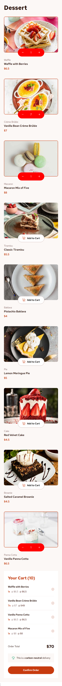
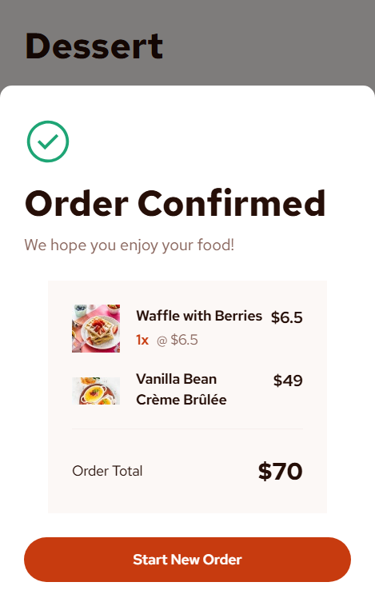
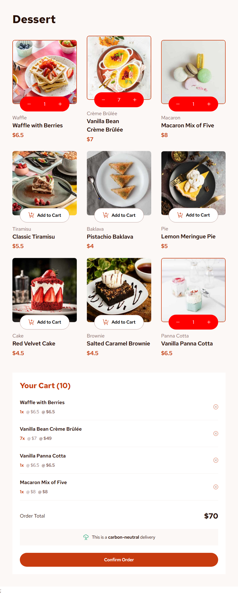
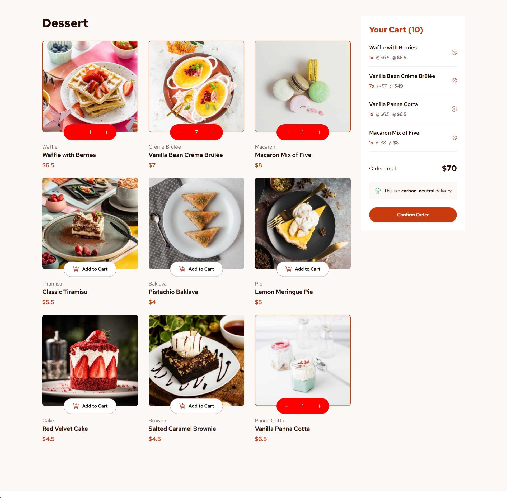
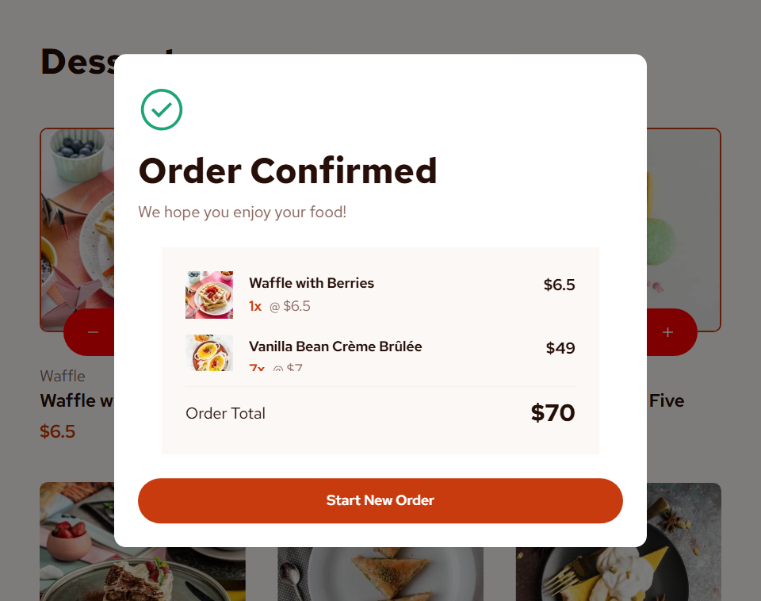

# Frontend Mentor - Product list with cart solution

This is a solution to the [Product list with cart challenge on Frontend Mentor](https://www.frontendmentor.io/challenges/product-list-with-cart-5MmqLVAp_d). Frontend Mentor challenges help you improve your coding skills by building realistic projects.

## Table of contents

- [Overview](#overview)
  - [The challenge](#the-challenge)
  - [Screenshot](#screenshot)

## Overview

### What I learnt?

I practiced to create and manage state in this project. It was an interesting project where I followed the following process:

- Determine components that will exist
- Create a flowchart to implement all desired features
- Create a static UI version
- Add state wherever necessary, use state and update state wherever is necessary. (taking care of when, and where to use state and the data flow)

### The challenge

Users should be able to:

- Add items to the cart and remove them
- Increase/decrease the number of items in the cart
- See an order confirmation modal when they click "Confirm Order"
- Reset their selections when they click "Start New Order"
- View the optimal layout for the interface depending on their device's screen size
- See hover and focus states for all interactive elements on the page

### Screenshots

#### Mobile view + order confirmation modal

#### Tablet view

#### Desktop view

